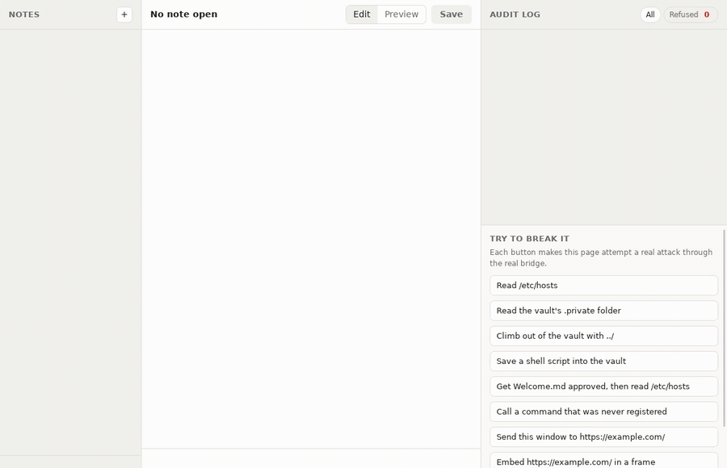

# Examples

All examples live in [`example/`](https://github.com/klarlabs-studio/vitra/tree/main/example) in the repository.

## Notes



```bash
make notes   # or: CGO_ENABLED=1 go run -tags vitra_native ./example/notes -vault ~/VitraNotes
```

A Markdown notes app over a vault folder. The window may:

| Permission | Scope |
|---|---|
| `fs.read` | `<vault>/**`, except `<vault>/.private/**` |
| `fs.write` | `<vault>/**/*.md`, except `<vault>/.private/**` |
| `vault.info`, `audit.read` | the vault location, the live audit log |

The **Try to break it** panel runs real attacks through the real bridge:

| Attack | Stopped by |
|---|---|
| Read `/etc/hosts` | path scope: `path_out_of_scope` |
| Read `.private/credentials.md` | deny pattern: `path_denied` |
| `<vault>/../.ssh/id_ed25519` | `..` is rejected |
| Save `payload.sh` into the vault | writes allow `*.md` only |
| Get `Welcome.md` approved, read `/etc/hosts` | input path must equal the authorized path |
| Call `shell.exec` | only registered commands exist: `command_missing` |
| Navigate the window to a remote site | navigation policy |
| Embed a remote page | navigation policy, for frames too |
| Forge a call from a sandboxed frame | sender token: dropped |

Worth reading: `notes.go` (grants and typed commands), `liveaudit.go` (an audit sink that streams to the window), and `notes_test.go` (every attack as a test).

## Menu bar

```bash
make menubar   # or: CGO_ENABLED=1 go run -tags vitra_native ./example/menubar
```

A menu bar (tray) app with no Dock icon or taskbar entry: the free space on a disk next to the tray icon, and the details in an HTML panel that drops down when you click it. The panel may read the usage and close itself; its attempt to read the clipboard is refused. See [Menu bar apps](/guide/menubar).

## Competitive

```bash
make demo   # Linux, headless under xvfb
CGO_ENABLED=1 go run -tags vitra_native ./example/competitive
```

A tour of every official plugin: dialogs, clipboard, window chrome, menus, the tray, shortcuts, drag and drop, deep links, notifications, and scoped files. Use it as the reference for binding desktop services.

## Quickstart

```bash
go run ./example/quickstart
```

The kernel with no window: register a grant and a typed command (`vitra.Register`), invoke it, see a deny pattern win over the grant's allow, and watch navigation drop the window's authority. It runs anywhere, without cgo.
